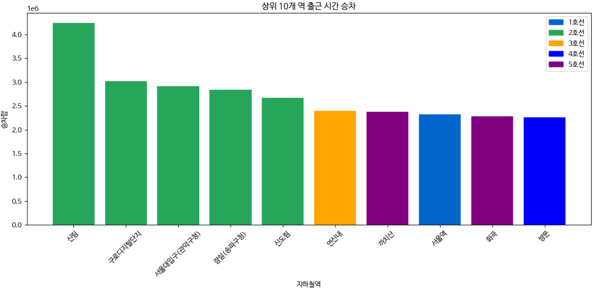
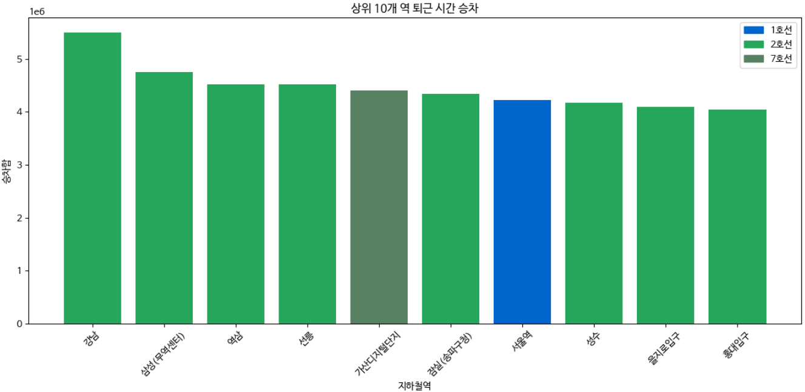
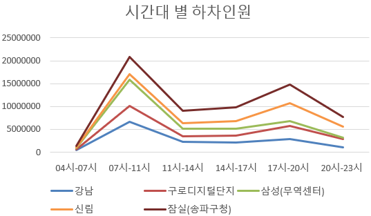

# 🎓 Project : 행복지수를 위협하는 출퇴근 지하철 

**본 프로젝트는 각자가 생각하는 사회 속 문제를 정해 데이터를 이용해 분석해보고 토론 글을 작성하는 프로젝트입니다. 저는 '지하철 혼잡'을 문제로 선정해 데이터를 분석해보고 지하철 문제를 해결할 대안을 제안했습니다.**

- **Team Type :** 개인 프로젝트
- **Members :** 임서현
- **Period :** 2025.07.05 ~ 2025.08.23
- **Tech Stack :** Python 
---
## 📑 목차 (Table of Contents)

1. 프로젝트 개요
2. 내 역할
3. 데이터 소스
4. 주제 선정 배경 
5. 데이터 분석 및 결과
6. 해결 방안 
7. 원고 업로드
8. 아쉬웠던 점 및 배운점
---

## 1. 프로젝트 개요
- **문제 제기 :**
  작년 인턴 활동을 하면서 출퇴근을 지하철을 주 교통수단으로 이용했습니다. 직장인들이 많이 붐비는 시간대에 직접 나가보니 출,퇴근 길의 일명 '지옥철'을 체감할 수 있었습니다. 이때의 경험을 되살려 일상 속 사회 문제로 출퇴근 지하철을 주제로 정하게 되었습니다. 본 프로젝트는 서울시 지하철 데이터를 기반으로 출퇴근 시간대 혼잡의 구조를 분석하고, 이동권과 세대 갈등을 함께 고려한 정책 대안을 제안한 데이터 분석 프로젝트입니다. 
---

## 2. 내 역할 
- **데이터 수집**
    - 서울시 지하철 호선별·역별·시간대별 승하차 인원 데이터
    - 노인 무임승차 제도 관련 국민 인식 통계 자료
    
- **데이터 분석**
    - Python 기반 호선별 출·퇴근 시간 상위 10개 역 분석
    - Python 기반 시간대별 승하차 인원 패턴 분석

- **원고 작성**
    - 분석 결과를 바탕으로 사회 문제 정의 및 정책 제안 글 작성 
---

## 3. 데이터 소스 
| 데이터셋 명 (Dataset) | 기간 (Period) | 기간 형태 |출처 (Source) |
| --- | --- | --- |
| 서울시 지하철 호선별 역별 시간대별 승하차 인원 정보 | 2015-2025| 월별 | 서울 열린데이터 광장 |
| 서울시 지하철호선별 역별 승하차 인원 정보 | 2025 | 월별 | 서울 열린데이터 광장 |

---
## 4. 주제 선정 배경 
**문제 정의**

> 출퇴근 시간대 지하철 혼잡은 장거리일 수록 시민의 스트레스, 행복도 저하와 연관있습니다. (출처 : 서울 연구원)

> 30분 이내 통근 비중은 줄어드는 반면 60~120분 통근 비중은 오히려 늘고 있습니다. 또, 한국의 평균 출퇴근 시간은 OECD 국가 중 가장 길다는 조사도 있습니다. (출처 : 통계청)

또한 개인적으로 회사 생활을 하면서 출근길 지하철 혼잡으로 인한 피로와 업무 집중력 저하를 경험했습니다. 개인적 경험과 신뢰성있는 근거 자료를 바탕으로 출퇴근 시간대 지하철 혼잡을 주제로 선정하게 되었습니다. 
본 프로젝트에서는 출근·퇴근 시간대 승하차 인원 집중 구조와 혼잡이 특정 노선·지역에 집중되는지 중점으로 분석했습니다. 

---
## 5. 데이터 분석 및 결과 
### 0. 데이터 개요
서울 열린데이터 광장에서 제공하는 지하철 승하차 및 시간대별 인원 데이터를 이용해 출퇴근 시간에 지하철 혼잡이 가장 많은지에 관한 분석을 통해 검증했습니다. 

### 1. 출·퇴근 시간대 승하차 인원 분석
- **데이터 전처리 :** 분석 대상 기간을 최근 연도(2025년) 기준으로 필터링 / 출퇴근 시간대만 추출해서 확인 / 역별·시간대별 승차 / 하차 인원을 집계하여 총 승하차 인원 계산 / 불필요한 컬럼 제거 
- **분석 목표 :** 출·퇴근 시간대에 승하차 인원이 집중되는 상위 10개 역을 도출하여, 지하철 혼잡이 주거지 인접 역과 업무지구 역에 구조적으로 집중되는지 확인하고자 했습니다. 
- **분석 결과 :** 

  
  > 출근 시간의 경우 연신내, 까지산, 화곡 등 주거지 인접 지역에서 승차 인원이 가장 많습니다.
  
  
  > 퇴근 시간의 경우 강남, 역삼, 잠실 등 업무지구 지역에서 승차 인원이 가장 많습니다. 
- **코드 설명 :** 자세한 데이터 전처리 코드는 [`data_analysis/5_analysis/src/commute_analysis.py`](data_analysis/5_analysis/src/commute_analysis.py)에서 확인할 수 있습니다.

### 2. 시간대별 승하차 패턴 분석
- **데이터 전처리 :** 서울시 지하철 데이터를 역·호선·시간대 단위로 집계 / 전체 역 중 승하차 인원 총합 기준 상위 10개 역을 선정 
- **분석 목표 :** 하루 중 시간대별 승하차 인원 변화 패턴을 분석하여, 혼잡이 특정 시간대(출·퇴근 시간)에 집중되는지 확인하고 전 시간대 일괄 정책보다 피크타임 중심 정책 조정이 타당한지 검증하고자 했습니다. 
- **분석 결과 :** 

  
  
  
  > 승하차 모두 출근 시간대인 07-10시에 급격히 증가하고 점차 줄어들다가 17-20시인 퇴근 시간대에 급격히 증가하는 양상을 보이고 있습니다. 
- **코드 설명 :** 최종 정리된 데이터 전처리 코드는 [`data_analysis/5_analysis/src/time_commute_analysis.py`](data_analysis/5_analysis/src/time_commute_analysis.py)에서 확인할 수 있습니다.

### 3. 인사이트 (Insight) 
출퇴근 혼잡은 단순히 이용객 수 증가 문제가 아니라, 주거지 인접 역에서의 출근 집중 승차와 업무지구 역에서의 퇴근 집중 승차가 
시간대별로 반복되는 이동 구조에서 발생하는 구조적 문제임을 데이터로 확인했습니다.

---

## 6. 해결 방안 
**목표 :** 
분석 결과를 바탕으로 출퇴근 시간대에 업무, 주거 지역을 중심으로 출퇴근 시간대의 승하차 인원이 많다는 것을 확인했습니다.
저는 지하철 혼잡 문제 해결 방안으로 여러 대안이 있지만 그 중 65세 이상 노인 무임승차 제도에 집중했습니다. 

**현 정책의 문제** 
  
노인 무임승차 혜택에 찬성하는 비율이 70%에 달합니다. 하지만 동시에 지하철 재정 적자 문제는 매년 반복적으로 보도되고 있습니다.
이를 통해 저는 노인 이동권을 보장하고 세대 간의 갈등을 최소화하는 선에서의 정책을 제안하고자 합니다. 

**정책 제안**
1. 출퇴근 시간대 노인 무임승차 제도 조정
혼잡한 출퇴근 시간대(07-10시 & 17-20시)에는 노인분들도 똑같이 요금을 지불하고, 그 외 시간에는 기존처럼 무료로 이용할 수 있게 하는 방식입니다. 이렇게 하면 혼잡 시간대 불필요한 수요를 억제하면서도 비혼잡 시간대에는 기존 제도를 유지해 노인 이동권을 보장할 수 있습니다. 

2. 노인 전용칸 운영 방식 조정
혼잡 시간대에는 노인 전용칸을 일부 줄여 일반칸으로 운영하는 방법입니다. 노인분들의 이용은 보장하면서도 전체 승객 수용 능력을 늘려 혼잡 완화에 조금이라도 기여할 수 있습니다. 본 분석에서 출퇴근 시간대 승차 인원이 특정 역과 시간대에 집중됨을 확인했기 때문에, 전 시간대 일괄 정책이 아닌 피크타임 중심의 조정이 더 효과적이라고 판단했습니다. 

## 7. 원고 업로드
데이터 분석 결과와 정책 제안을 바탕으로 토론 원고를 작성하고 업로드했습니다.
해당 글은 '빠띠' https://campaigns.do/discussions/3099 에서 읽으실 수 있습니다. 

## 8. 아쉬웠던 점 및 배운 점 
중간에 다른 프로젝트 일정과 겹쳐서 해당 프로젝트에 있었던 2번의 멘토링 기회를 모두 불참하게 됐습니다. 멘토링을 통해 전문가들의 피드백을 받아보고 다양한 데이터를 통해 더 단단한 결론으로 만들 수 있을 거 같은데 그러지 못해 아쉬웠습니다. 그러나 데이터 분석에서 그치지 않고 분석한 내용을 바탕으로 원고도 직접 작성해보면서 데이터를 통해 스토리텔링을 이런 방식으로 하면 되는 거구나를 알게되었습니다. 또한, 마지막날 콘텐츠 공유회를 해보면서 다양한 관점에서 여러 사회 문제를 바라보고 다 같이 토론하는 시간이 의미 있었습니. 추후에는 노인 이용 시간대 데이터를 추가 분석해 보다 정량적인 정책 효과를 검증해보고 싶습니다. 
